# 🛡️ DNS Guard (Pi-hole + Unbound)

Self-hosted Network-wide Ad Blocking and Local DNS resolver using **Docker Compose**. This project aims to provide privacy, speed, and cleaner browsing for all devices on the local network.

<div align="center">
  
  <br/>
  <em>"The Black Hole for Internet Advertisements"</em>
</div>

---

### 💡 The Architecture

```mermaid
graph TD
    %% Styles
    classDef client fill:#2c3e50,stroke:#fff,stroke-width:2px,color:white;
    classDef pihole fill:#e74c3c,stroke:#fff,stroke-width:2px,color:white;
    classDef unbound fill:#f1c40f,stroke:#fff,stroke-width:2px,color:white;
    classDef internet fill:#3498db,stroke:#fff,stroke-width:2px,color:white;

    Client["📱 Laptop / Mobile"] ==>|"DNS Query (Port 53)"| Pihole["🛡️ Pi-hole Container"]
    
    subgraph "DNS Guard Stack"
        Pihole -.->|"Blocked Domain?"| Gravity[("🚫 Blocklist")]
        Pihole ==>|"Allowed? Forward Query"| Unbound["🕵️ Unbound (Recursive DNS)"]
    end

    Unbound -.->|"Recursive Lookup (Port 5335)"| Internet["🌍 Internet Root Servers"]
    
    %% Classes
    class Client client
    class Pihole pihole
    class Unbound unbound
    class Internet internet

```



| Component | Function |
| --- | --- |
| **Pi-hole** | Acts as the **Gatekeeper**. It checks every request against a blocklist of ad/tracker domains. If it's bad, it blocks it (returns 0.0.0.0). |
| **Unbound** | Acts as the **Recursive Resolver**. Instead of asking Google (8.8.8.8) where a website is, it asks the Root Servers directly. Maximum privacy, no logs. |

---

### 🚩 The Challenge: Residence Network (ISP Constraints)

This project was deployed in a university dormitory with a restricted ISP (**ASK4**). We encountered specific constraints that provide valuable learning points for restrictive network environments.

#### 1. The "Unbound" Blockade (Firewall)

* **Problem:** The ISP blocks or heavily throttles recursive DNS traffic (UDP high ports or direct queries to Root Servers) to prevent abuse.
* **Symptom:** Unbound resulted in timeouts and extremely slow browsing.
* **Solution:** While the `docker-compose` includes Unbound for standard networks, in this specific environment, we had to switch Pi-hole's upstream DNS to **Cloudflare (DNSSEC)** to bypass the firewall and restore speed.

#### 2. The DHCP Limitation (No Router Access)

* **Problem:** In a residence, you are a "client" inside a huge network. You do not own the main Router, so you cannot set Pi-hole as the global DNS distributor via DHCP.
* **Consequence:** Automatic network-wide blocking is impossible without an intermediate router (Travel Router).
* **Workaround:** DNS settings must be configured **manually** on each client device (PC, Phone).

---

### 🛠️ Tech Stack

* **Platform:** Raspberry Pi 5 / Linux
* **Container Engine:** Docker & Docker Compose
* **Networking:** Bridge Network (172.20.0.0/16)

---

## ⚙️ Client Configuration

Since we cannot push DNS settings via the residence router, we configure the Network Interface manually on Windows to point to our Raspberry Pi.

**Steps taken:**

1. Access Network & Internet settings.
2. Edit IP assignment for the Ethernet/Wi-Fi adapter.
3. Set **Preferred DNS** to the static IP of the Raspberry Pi (`10.9.129.175`).

<div align="center">
    
    <br/>
    <em>"Manual DNS Configuration on Windows 11"</em>
</div>

---

### 🔬 Network Verification (Proof of Life)

To validate the configuration, we performed a packet capture analysis using **Wireshark**.

**Evidence:**
The capture below demonstrates a client sending standard DNS queries (e.g., for `www.bbc.com`) directly to the Pi-hole IP (`10.9.129.175`) instead of the default gateway. This confirms that traffic is correctly routed through our filtering container.

<div align="center">
    
    <br/>
    <em>"Wireshark Capture showing DNS traffic flowing to Pi-hole"</em>
</div>

---

### 🚀 Installation

1. **Clone the repository:**
```bash
git clone [https://github.com/franlrs/dns-guard.git](https://github.com/franlrs/dns-guard.git)
cd dns-guard
```


2. **Configure Security:**
Rename the example environment file and set your password.
```bash
cp env.example .env
nano .env
```


3. **Deploy:**
```bash
docker compose up -d
```


4. **Access:**
* **Web Interface:** `http://<raspberry-ip>:8081/admin`
* **Password:** The one set in your `.env` file (or changed via CLI).


---

### 📄 License

Project developed by **franlrs**. Distributed under the [MIT License](LICENSE).